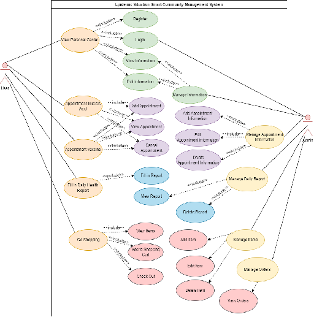

<h1 align="center">SWE310 Group Project</h1>
<h2>Content</h2>
This is the group project for course SWE310 Programming Elective II(2). The Epidemic Situation Smart Community Management System is a system integrating daily health report submitition, vaccine, nucleic acid appointment and shopping. It aims to help community workers better manage community residents under the epidemic situation, and also help users more conveniently make health declaration, vaccine, nucleic acid appointment, and purchase anti epidemic supplies.
<h3>General Use Case</h3>

<h2>Contributers</h2>
        

            

              
              

                  

                <h5 class="card-title">Lei Yitao</h5>
                  <h5 class="card-subtitle"><a href="mailto:SWE1909475@xmu.edu.my">SWE1909475@xmu.edu.my</a></h5>
                
Shopping and shop store, user management and item management

                

              

            

            

              
              

                  

                <h5 class="card-title">Xiao Yihong</h5>
                  <h5 class="card-subtitle"><a href="mailto:DMT1909204@xmu.edu.my">DMT1909204@xmu.edu.my</a></h5>
                
User register, login, user information management, management interface refinement and bug fix

                

              

            

            

              
              

                  

                <h5 class="card-title">Wu Yuxuan</h5>
                  <h5 class="card-subtitle"><a href="mailto:SWE1909497@xmu.edu.my">SWE1909497@xmu.edu.my</a></h5>
                
Vacinne and NAT appointment and management, and management interface functions supplement.

                

              

            

            

              
              

                  

                <h5 class="card-title">Wu Yijin</h5>
                  <h5 class="card-subtitle"><a href="mailto:SWE1909494@xmu.edu.my">SWE1909494@xmu.edu.my</a></h5>
                
Front end，master page， start page， health report， health report management.

                

              

            

        
